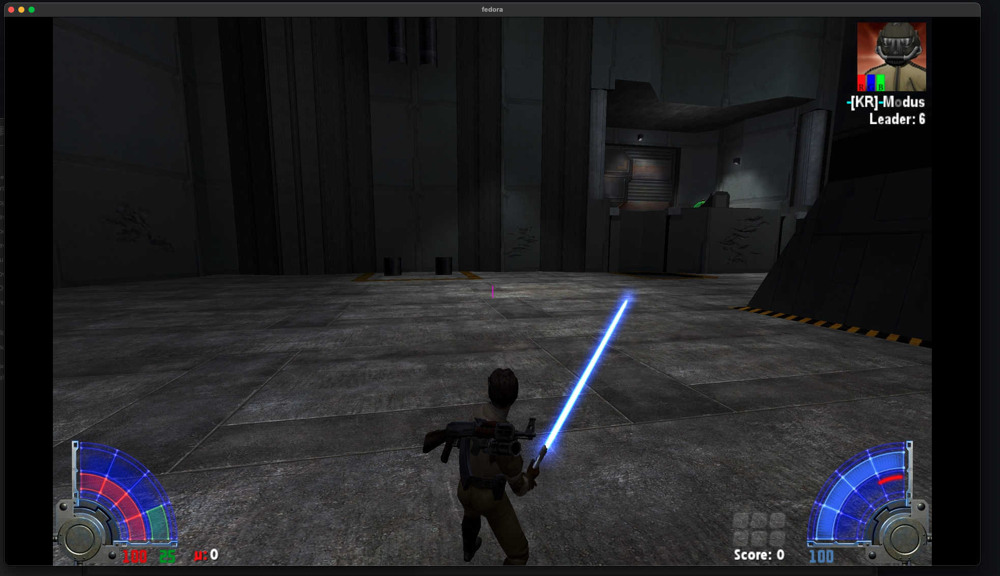

This is literally just [Sunny's EternalJK fork](https://github.com/JKSunny/EternalJK), with the implementation of /cosmetics from TaystJK. Other then that, it's just your standard EternalJK. Sunny's fork was used because he provided updated cmakelists & build scripts to compile for Apple Silicon. This includes a recent JAPro asset bundle, the cJSON lib, and some copy and paste jiujitsu of Tayst's work. This provides the ability to use /cosmetics on non-JAPro servers (Base, JAPlus, etc). Because you're missing out when you don't see TiW with his Ugnaught afro and a goose on his shoulder. 

---

# Provided releases:

- ARM Apple silicon 
- 64bit Windows
- 64bit Linux

---

# Installation:
- MacOS Apple Silicon:
  - Download the [release](https://github.com/nihirisuto/Sunny-EternalJK-With-TaystJK-Cosmetics/releases/tag/naisu) marked for MacOS arm64 (Apple Silicon). You can extract the files into an existing EternalJK directory & overwrite japro-assets.pk3 & the dylibs, or create a new directory for this install, add a /base folder and add your asset files.
  - Before launching the app, you'll need to codesign it. In terminal navigate to the extracted files, and run the following:
 
    `codesign --force --deep --sign - EternalJK.arm64.app`

    If you attempted to open the file before codesigning, you may need to remove the quarantine MacOS has placed on it, followed by running the above codesign step:
	
    `xattr -d com.apple.quarantine EternalJK.arm64.app`

- Windows 64-bit:
  - Download the [release](https://github.com/nihirisuto/Sunny-EternalJK-With-TaystJK-Cosmetics/releases/tag/naisu) marked for Windows x86_64. Probably best to create a new directory for this install, add a /base folder and add your asset files. Dump your EternalJK config into the EternalJK folder and call it a day. (dll names are different than buckys dll names of 10 years ago)

- . @P2 (Linux):
  - Download the [release](https://github.com/nihirisuto/Sunny-EternalJK-With-TaystJK-Cosmetics/releases/tag/naisu) marked for Linux x86_64. Add a /base folder with your assets into the extracted directory. 
  - Navigate to the extracted dir. In terminal (or if you're gnomin it or something right click **eternaljk.x86_64** > properties > check to allow to run as an executable)
  
    `chmod +x eternaljk.x86_64`